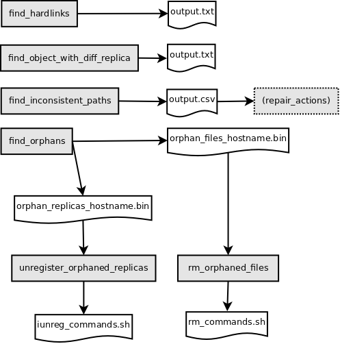

# Index to DrRods tools
To learn the syntax of each program, invoke the program with option _-h_.   
Most programs will need to be run on an iRODS Provider Server, or on
another system that has connectivity to the PostgreSQL Server that carries
the ICAT database.

Important: **The DrRods tools will NOT make any modifications to your iRODS
system.** In most cases, the tools will output a file that contains
an analysis report.
In some cases the output is a bash script that an iRODS administrator
may decide to use to make actual changes to her iRODS system.

## find\_hardlinks
*We have run this program on a system with 70 million replicas.
Execution time was 12 minutes.*

iRODS expects data object to be addressable via only a single logical
name (which is the combination COLL\_NAME/DATA\_NAME).
This logical name is registered with each replica of the data object.

On our production zones, we have encountered a few isolated cases 
where some of the replicas
of a single data object have a different logical name. 
We will refer to this phenomenon as a hardlinked data object, 
since the data object
identifies itself by more than one name (has aliases).

Hence an "ils" command may show 2 data objects while in fact there is
just one. In practice, this may lead to unexpected behavior when the 
user performs
an operation on one of these data objects, e.g. executes an "imv" or "irm"
command. It will turn out that the other object is affected as well.
Therefore, hardlinked data objects can potentially cause data loss.

The program locates hardlinked data objects and reports them. It is up
to the iRODS System Administrator to then manually inspect the objects 
in detail and to decide a repair strategy.  Our experience is that
the action to be taken changes from case to case.

A conservative strategy is to use "icp" to copy one alias name to 
a new destination data object, and then trim the replicas listed 
under the same alias name in the source object.  Make sure to also copy
the metadata (imeta) and authorizations (ichmod). 

Note that in case of overlapping replica numbers (yes we have encountered 
such a case), 
an attempt to unregister a replica by replica number might fail. 

## find\_inconsistent\_paths
*We have run this program on a system with 70 million replicas.
Execution time was 25 minutes.*

Unless the storage system is less suited to accomodate this, iRODS will
attempt to create and maintain a directory structure for data files that 
mimics the collection hierarchy. 
In particular it uses this strategy for unixfilesystem resources.

Incomplete or incorrectly executed iRODS operations may result in
persistent data that no longer mimics the collection hierarchy.

Potential causes are prematurely crashed iRODS Agents, bugs in the iRODS 
Data Virtualization software. Another cause can be a policy added
to the system, that has side-effects that impact the consistency
of iRODS operations.

This program locates replicas which have an attribute data\_path
that does not properly mimic the logical path. 
Replicas that reference a data file located outside the vault directory 
are ignored.
The output is a csv-formatted file. Each row holds information on 
a replica, where the column 'expected\_data\_path' depicts an alternative
path that is derived from the logical path.

Whenever a data\_path does no longer mimic the logical path, there exists
a risk of replicas becoming soft-linked during subsequent data operations. 

A soft-linked replica references a data file that is *also* referenced
by an entirely different data object. 
Note that this situation could lead to data loss: 
When a user deletes one of the 
involved data objects, then the linked replica of the other data object can no
longer access its data file, even though it may appear to be 'good'. 

iRODS release 4.2.9+ provides for logical locking of data objects and their
replicas. This should greatly assist to prevent any new occurrences of 
inconsistent paths. 

## find\_objects\_with\_diff\_replicas
All good replicas of a data object should by definition have equivalent attributes.

This program reports data objects that have multiple good replicas yet where the attributes 
vary from one replica to another.
The attributes being compared are data\_type, data\_size, and data\_owner 
(including data\_owner\_zone).  

## find\_same\_resource\_replicas 
Each replica of a data object should reside on a separate resource.

This program reports data objects that have more than one replica stored on the same resource.

## find\_orphans
*We have run this program on a system with 70 million replicas.
Execution time was 7 hours on the iRODS Provider. The execution time
of a run on the same system using iscan was 41 hours.*

This program performs two functions, much similar to,
yet typically faster than, the icommand "iscan":

- It locates _orphan data files_, files that are located in the resource vault
yet not registered in the ICAT database.
- It locates _orphan replicas_, replicas that reference a data file that
no longer exists or is otherwise inaccessible.

The program caches information retrieved from the ICAT in a memory database,
and uses the replica attribute "data\_path" to see if the referenced
data file exists. 

Note that this program needs access to both the ICAT database as well as 
the resource vaults. Therefore it needs to run on the iRODS provider and 
the iRODS consumer servers (separately). In case there is no network 
connection allowed from an iRODS Consumer to the PostgreSQL database server
one can use the option to export/import cached ICAT data and transport 
the export file to the iRODS Consumer Server..

A list of orphan replicas is saved in a binary file, suitable for postprocessing
by the program *unregister\_orphaned\_replicas*.   
NB: Actually, rather than a replica name and number, the content of the 
attribute data\_path is stored.

A list of orphan data files is saved in another binary file. This output
can be postprocessed by the program *rm\_orphaned\_files*.

## unregister\_orphaned\_replicas
This program takes a binary input file as produced by the *find\_orphans*
program, and creates a bash script with iunreg commands for those replicas.
The iRODS System Administrator can execute this bash script to clean
up the orphan replicas.

Replicas may be (or become) in-flight. 
The program implements two safety precautions against touching such replicas:
1) In-flight replicas are skipped during the creation of the bash script.
2) Also the iunreg commands in the bash script will carry an -age option,
to prevent operations on replicas modified less than a day ago.

## rm\_orphaned\_files
Like the above program, this program takes a binary input file as produced
by the *find\_orphans* program. It creates a bash script with commands
to delete these (orphan) data files. The iRODS System Administrator can 
execute this bash script to clean up the orphan data files.

To prevent accidental deletion of recently modified data files, the script
uses a Linux *find -delete* command instead of *rm* and selects only files that have
a modified time of at least 1 day ago.

## Supporting Python Modules
Supporting Python modules are:
- *icat* (class) handles the connection to a PostgreSQL database.   
- *pathdb* (class) manages an in-memory database of pathnames   
- *drrods_sql* (functions) provides functions to retrieve ICAT data   
- *drrods_common* (globals/functions) provide utility functions used across the tools

